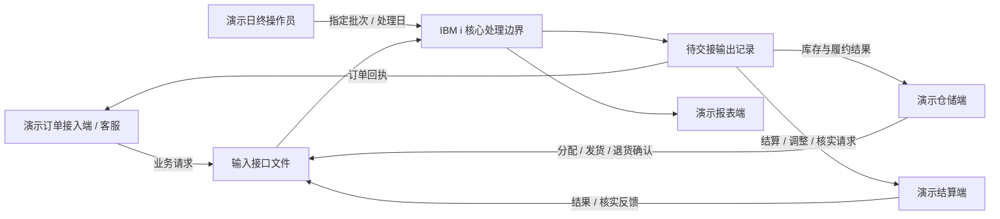
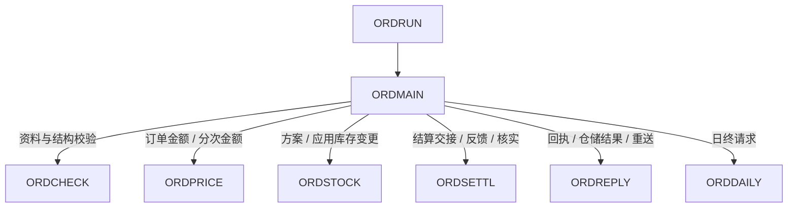
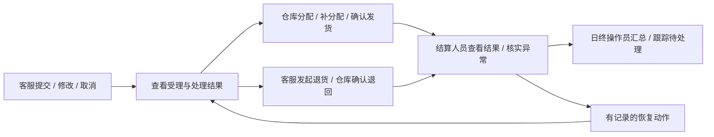
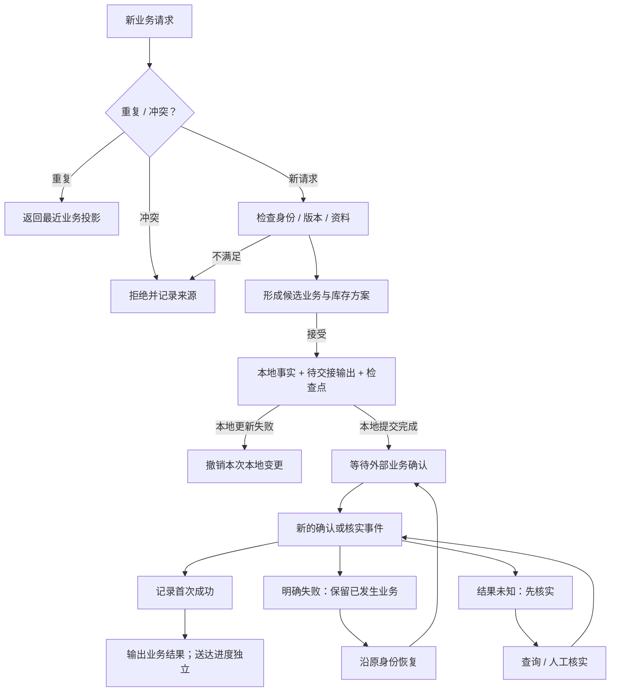
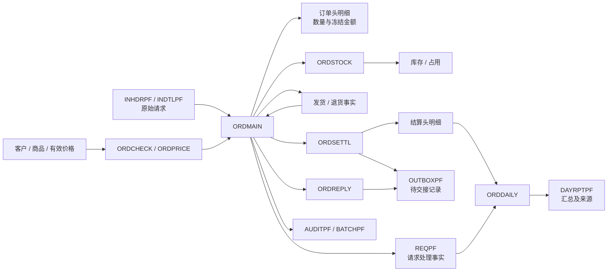

# 多仓订单履约与结算：合成样本技术设计

## 1. 文档信息（Document Header）

- **设计编号**：TD-20260905-01
- **设计级别**：L3 Full
- **版本 / 状态**：1.1 / Draft
- **变更类型**：New Program
- **方案类型**：Mixed，固定格式 RPGLE、CLLE 和 DDS。
- **输入**：[FS-20260905-01 功能需求](../requirements/functional-requirements.md)及 [README 的 BC-01～BC-09](../../README.md#本项目的评测与样本约束)。
- **相关程序**：ORDRUN、ORDMAIN、ORDCHECK、ORDPRICE、ORDSTOCK、ORDSETTL、ORDREPLY、ORDDAILY。
- **说明**：将 16 项功能和 32 条规则分配到程序、数据对象及交互边界，作为后续程序规格与文件规格的输入。

所有对象名称、结构和技术选择都是按用户授权制定的合成设定，不是对真实系统的发现。本文属于生成与评审材料，不直接提供给被测模型；图中关系是设计关系，尚无源码或运行证据。

## 2. 修订历史（Amendment History）

| 版本 | 日期 | 作者 | 变更 |
| --- | --- | --- | --- |
| 1.0 | 2026-09-05 | Codex | 首次设计；确定程序分工、数据对象、接口、交易边界、规则归属及下游工作范围。 |
| 1.1 | 2026-09-05 | Codex | 关联文件／程序规格；明确作业级承诺定义、字段及调用契约交接，更新待细化状态。 |

## 3. 设计概述（Design Overview）

采用文件驱动的批处理结构，将各业务角色的操作统一表达为带关联身份的业务事件。一个大型固定格式主程序决定业务路径和状态变化，六个配套程序负责资料校验、金额计算、库存变更、结算接口、回执和日终汇总。CL 驱动提供批次入口及作业级异常收尾。内部调用为同步调用，外部业务交接采用接口文件及后续确认事件，便于静态分析跨程序路径与异步结果。

## 4. 业务背景与触发（Business Context / Trigger）

- **业务事件**：提交、修改、分配、发货、取消、退货、结算反馈、恢复、回执反馈及日终处理。
- **业务目的**：保持订单、库存、履约和结算之间的可解释关系，并保留重复、失败和恢复过程。
- **当前状态**：N/A——没有真实既有系统；仅有合成功能需求。
- **目标状态**：事件从统一入口进入，跨程序处理后产生业务记录、接口输出和可追溯结果。
- **操作背景来源**：角色及 18:00 截点来自需求 BR-29 和角色说明，后续共享背景材料应明确提供这些事实，不把它们包装成源码分析发现。

## 5. 设计目标（Design Objective）

让后续生成的主程序满足万行固定格式样本要求，同时让每条重要路径能沿入口、条件、调用、数据对象和结果闭合。采用明确的写入责任、关联身份和局部事务边界，使静态分析能够区分原始请求、订单版本、履约事实、结算结果与回执状态。保持设计与需求的编号追踪，避免下游生成不同版本的业务定义。

## 6. 范围与边界（Scope and Boundary）

### 范围内

- 8 个程序的责任划分、调用关系和返回语义。
- 21 个 PF、3 个 LF 的用途、访问责任及命名基线，3 个共享 COPY 源成员的职责。
- 业务事件、相关身份、独立状态维度、外部消息和恢复边界。
- 四类 Flow 的设计依据，32 条业务规则和 16 项功能的归属。

### 范围外

- 程序规格、完整字段字典、参数类型长度、返回码清单、子程序拆分和逐行实现。
- 实际 RPGLE、CLLE、DDS、测试数据、编译命令或部署脚本。
- IBM i 编译或运行、外部接口联通、模型调用和评测报告。
- 真实消息中间件、Web 服务、界面、网络和权限平台。

### 边界条件

主程序规模及固定格式以 README 为准。本设计保留完整业务状态变化的表达，但不承诺源码能直接编译运行。共享输入背景只能描述演示操作和接口条件；本设计中的流程、规则归属及参考路径保留在评审侧。

## 7. 方案概览（Solution Overview）

ORDRUN 将指定批次或日终请求交给 ORDMAIN。ORDMAIN 保留业务分派、订单状态判定、跨对象一致性和恢复协调，配套程序只在明确的责任范围内处理资料、计算和输出。所有核心更新由同一主程序协调，配套程序不独立结束调用者的本地事务。对外输出先形成待交接记录，之后以新的反馈事件进入；文件已写出不等于对端已完成业务。

### 设计决策

| 编号 | 合成技术设定 | 理由与边界 |
| --- | --- | --- |
| DD-01 | 一个大型 ORDMAIN，加六个辅助 RPGLE 和一个 CLLE 驱动。 | 主程序承载跨区域逻辑，满足大型遗留程序分析目标；这不是生产系统规模划分建议。 |
| DD-02 | 固定格式 H/F/D/C 规格、子程序及显式调用，使用外部描述文件。 | 延续固定格式、指示器和跨子程序状态等分析重点；指示器分配和具体操作码留给程序规格。 |
| DD-03 | 输入信封与规范业务请求分开，输入保留原文，业务账本保存去重及关联结果。 | 能解释重复、冲突、缺字段和跨批次重送；不能只靠对象名称推断身份。 |
| DD-04 | 内部同步调用，外部以文件载体异步交接。 | 既有可追踪调用链，也有发送、送达和业务确认之间的边界。 |
| DD-05 | 业务本地更新、请求处理结果、审计和批次检查点同属一个提交单元。 | 防止业务已经生效但重启后被当作未处理；拒绝记录使用独立、无业务副作用的结果单元。 |
| DD-06 | 校验／计算形成候选结果，全部前提满足后应用本地变更。 | 保持修改失败时原订单和库存不变，避免多明细发货出现部分成功。 |
| DD-07 | 订单、履约、结算、回执分别表达进度。 | 已发货但结算失败是合法组合；重送回执不会重做业务。 |
| DD-08 | 业务状态只由 ORDMAIN 判定，指定配套程序负责相应对象的实际写入。 | 允许跨程序更新，又保持状态迁移和提交责任清晰。 |
| DD-09 | 演示核心按单作业串行写入运行模型设计；外部反馈也由同一入口处理。 | 保留版本检查及恢复逻辑，当前不扩展多实例调度或跨作业一致性方案。 |

### System Flow：虚构系统边界

上述系统名和交互方式是输入背景的一部分。核心与外部之间的箭头表示业务文件交换，不表示实际 HTTP、MQ、网络部署或已验证的交付时延。

## 8. 程序责任分配（Module / Responsibility Allocation）

### Module Allocation Table

| Object | Type | Status | Primary Role | Responsibility | Depends On | Depended On By |
| --- | --- | --- | --- | --- | --- | --- |
| ORDRUN | CLLE PGM | New | Orchestration | 接收批次／处理日／运行意图，管理承诺控制前提和异常退出；不承载业务规则判定。 | ORDMAIN；作业上下文 | 演示操作员／调度端 |
| ORDMAIN | RPGLE PGM | New | Orchestration | 万行主程序；拥有事件分派、版本与状态判定、订单／履约事实、事务协调、审计及批次进度；兼任 Validation / Update。 | 六个配套程序；请求、订单、履约、审计和批次文件 | ORDRUN |
| ORDCHECK | RPGLE PGM | New | Validation | 核验客户、商品、数量和明细结构，提供规范化请求比较依据；不更新业务文件。 | CUSTPF、ITEMPF；输入业务内容 | ORDMAIN |
| ORDPRICE | RPGLE PGM | New | Data Access | 读取有效价格并计算订单金额与累计比例分摊；不决定交易状态、不写业务事实。 | PRICEPF；客户等级、订单和原结算金额摘要 | ORDMAIN |
| ORDSTOCK | RPGLE PGM | New | Update | 提供库存候选方案，并在主程序授权的本地提交单元内应用分配、发货扣减、取消释放和退货归还。 | WHSEPF、STOCKPF、ALLOCPF | ORDMAIN |
| ORDSETTL | RPGLE PGM | New | External Integration | 管理正向／反向结算载体、结果核实和消息关联，按主程序状态决定写入结算对象及相关输出。 | SETLHDPF、SETLDTPF、SETLBYREF、OUTBOXPF | ORDMAIN |
| ORDREPLY | RPGLE PGM | New | External Integration | 生成订单回执及仓储结果，记录送达反馈和回执重送；不执行库存或结算业务。 | OUTBOXPF、OUTBYST；主程序提供的业务结果摘要 | ORDMAIN |
| ORDDAILY | RPGLE PGM | New | Data Access | 汇总已确认正向／反向结算和待处理事项，形成可追溯日终快照；兼任 Update，仅写日报结果。 | SETLBYDAY、SETLDTPF、REQPF、DAYRPTPF | ORDMAIN |

辅助程序自身不得发出 COMMIT 或 ROLBK。ORDMAIN 是本地提交决策的唯一正常路径所有者；ORDRUN 只在异常退出时做最后的未提交变更清理。图中配套程序之间没有隐藏互调。

### 大型主程序的责任边界

ORDMAIN 保留受理与去重、订单新建／修改、库存方案采纳、履约与取消、退货、结果处理、恢复、审计及日终协调等业务区域。六个辅助程序不把这些路径全部移走，使主程序退化为短小调用外壳。

后续程序规格再拆分子程序与工作区；本轮不预先按行数强行分配例程。物理行数达标时仍需分别统计声明、注释和实际计算规格，重复填充不能替代业务内容。

### Program Flow：支撑调用图

这是按事件选择调用的拓扑，不代表每个请求都依次调用全部配套程序。

## 9. 高层处理流程（High-Level Processing Flow）

### Operation Flow：人员操作视角

此图是需求中的合成运营背景，没有宣称从代码推断真实职责或审批制度。

### 逻辑阶段

阶段表示职责边界。一个业务请求会经过其中的适用阶段，反馈及恢复是新事件，不是原调用一直阻塞等待。

| 阶段 | 阶段内容 | Active Modules | 输入 → 输出 | 规则 |
| --- | --- | --- | --- | --- |
| Stage 1: 批次与输入定位 | 确认批次、处理日和输入范围，恢复已提交检查点。 | ORDRUN、ORDMAIN | 批次上下文 → 本次待处理信封 | BR-01, BR-28, BR-29 |
| Stage 2: 身份与前置检查 | 比较重复／冲突请求、订单存在性、当前版本及结构资料。 | ORDMAIN、ORDCHECK、ORDPRICE | 输入及当前业务 → 拒绝、重复投影或候选业务 | BR-01, BR-02, BR-03, BR-04, BR-05, BR-06, BR-07, BR-08, BR-09 |
| Stage 3: 订单及库存方案 | 形成新建／修改、计价、分配、补分配及取消的候选结果；满足条件后进入本地应用。 | ORDMAIN、ORDPRICE、ORDSTOCK | 当前订单及资料 → 接受、等待或保持原状 | BR-10, BR-11, BR-12, BR-13, BR-14, BR-15, BR-16, BR-18, BR-19 |
| Stage 4: 履约与售后事实 | 将被接受的发货或退货变为本地事实，同时形成结算／调整待交接记录。 | ORDMAIN、ORDSTOCK、ORDPRICE、ORDSETTL | 分配／原发货 → 履约事实、库存变化、待结算 | BR-14, BR-17, BR-19, BR-20, BR-21, BR-22, BR-23 |
| Stage 5: 结算结果与核实 | 处理外部确认、失败和未知结果；更新相应结算进度。 | ORDMAIN、ORDSETTL | 新反馈事件 → 成功、待恢复或待核实 | BR-24, BR-25 |
| Stage 6: 输出与回执 | 根据已接受的业务结果形成回执／仓储输出，独立维护送达情况。 | ORDMAIN、ORDREPLY | 业务结果 → 待交接输出或送达记录 | BR-26, BR-32 |
| Stage 7: 受控恢复 | 按原身份恢复明确失败、核实未知结果或仅重送回执，并保留人工处置。 | ORDMAIN、ORDSETTL、ORDREPLY | 恢复请求 → 已记录的恢复动作及结果 | BR-06, BR-24, BR-25, BR-26, BR-28, BR-31 |
| Stage 8: 请求闭合与批次推进 | 将当前输入结果、审计和检查点与对应本地变更一起确认，推进下一独立请求。 | ORDMAIN | 单次处理结果 → 业务账本、审计、检查点 | BR-27, BR-28, BR-32 |
| Stage 9: 日终综合 | 在单一稳定处理点输出已确认金额及待处理／未知／失败清单。 | ORDMAIN、ORDDAILY | 已确认事实与业务账本 → 日报快照及来源关联 | BR-30, BR-32 |

Stage 8 的结果及检查点归属于对应业务动作的本地提交单元，不是业务先提交后再独立记检查点。读取完批次仅表示输入已处理，不表示所有订单、结算或回执都已完成。

### Transaction Flow：典型跨事件路径

这张图覆盖需要外部确认的发货／退货等交易。纯资料拒绝、订单修改和库存分配可以在本地闭合，不强行进入结算阶段。退货是引用原发货的新交易，不重新开启原订单需求。

## 10. 数据与对象交互（Data / Object Interaction Design）

### 身份与数据权威

| 身份 / 数据类别 | 权威对象 | 作用 |
| --- | --- | --- |
| 输入信封身份：批次及输入序号 | INHDRPF、INDTLPF | 即使请求缺少来源或业务标识，也可定位拒绝来源；原始业务内容不被处理器改写。 |
| 规范请求身份：来源及请求标识 | REQPF | 保存原始请求关联、规范内容比较依据及处理事实；批次、到达时间、重送次数不改变业务身份。 |
| 订单及版本 | ORDHDRPF、ORDDTLPF | 新建后成为订单事实来源；有版本要求的动作成功后推进一次版本，拒绝及重复不推进。 |
| 分配与库存 | ALLOCPF、STOCKPF | 保留订单明细、仓库和占用关联，不将实物数量与分配数量混为一个状态。 |
| 发货与退货 | SHIPHDPF、SHIPDTPF、RTNHDRPF、RTNDTLPF | 作为发生过的业务事实保存；结算失败不能删除这些事实。 |
| 结算与调整 | SETLHDPF、SETLDTPF | 标识原发货、原结算及退货来源，保存当前处理进度和首次成功处理日。 |
| 对外交接 | OUTBOXPF | 区分业务身份、消息身份、消息种类和发送尝试；重送不创建第二笔业务。 |
| 业务历史与批次 | AUDITPF、BATCHPF | 历史可追溯，批次检查点与单次本地结果一致。 |
| 日终输出 | DAYRPTPF | 是可重建的汇总／清单快照，不是结算事实的替代来源。 |

REQPF 的原始受理事实与最近业务投影分开：重复请求读取当前关联业务进度形成回复，不把后来结算失败解释为最初发货没有发生。规范内容比较包含业务动作及原始处理日等语义内容，排除传输包装信息；保留完整比较依据，不只依赖摘要碰撞假设。

### Object Interaction Map

| Source | Target | Interaction | Data Exchanged | Direction |
| --- | --- | --- | --- | --- |
| 演示输入端 | INHDRPF、INDTLPF | 提供原始输入 | 业务请求、反馈、恢复动作及其明细 | → |
| ORDMAIN | BATCHPF、REQPF、AUDITPF | Read / Write / Update | 批次进度、请求身份和业务历史 | ↔ |
| ORDCHECK | CUSTPF、ITEMPF | Read | 客户有效性、等级及商品资格 | ← |
| ORDPRICE | PRICEPF | Read | 当前价格依据；历史比例分摊使用主程序提供的冻结金额 | ← |
| ORDMAIN | ORDHDRPF、ORDDTLPF | Read / Write / Update | 订单版本、有效需求、金额及生命周期摘要 | ↔ |
| ORDSTOCK | WHSEPF、STOCKPF、ALLOCPF | Read / Write / Update | 仓库政策、库存及订单占用 | ↔ |
| ORDMAIN | 发货及退货四个 PF | Read / Write | 追加被接受的实物流转事实与原业务关联 | ↔ |
| ORDSETTL | 结算两个 PF、OUTBOXPF | Read / Write / Update | 结算载体、反向关联及结算类消息 | ↔ |
| ORDREPLY | OUTBOXPF | Read / Write / Update | 回执、仓储结果及其送达进度 | ↔ |
| ORDDAILY | SETLBYDAY、SETLDTPF、REQPF、DAYRPTPF | Read / Write | 首次确认结果、组成明细、待处理请求及日报快照 | ↔ |

OUTBOXPF 按消息种类分配写入者：结算／调整／核实消息归 ORDSETTL，订单回执／仓储结果归 ORDREPLY。反馈由 ORDMAIN 先识别关联及允许的状态，再调用相应所有者；辅助程序不能修改其他类别消息。

### File Access Summary

所有对象为 New。此处列出键的业务含义，精确字段、顺序及长度由 File Spec 定义；LF 的排序意图必须保持。

| File Name | Kind | Accessed By | Access Type | Key Concept | Purpose |
| --- | --- | --- | --- | --- | --- |
| BATCHPF | PF | ORDMAIN | Read / Write / Update | 批次身份 | 批次范围、状态及最后已提交输入位置。 |
| INHDRPF | PF | ORDMAIN | Read | 批次、输入序号 | 原始信封；输入端提供，核心不改写原文。 |
| INDTLPF | PF | ORDMAIN | Read | 批次、输入序号、明细序号 | 原始请求的多行内容。 |
| REQPF | PF | ORDMAIN、ORDDAILY | Read / Write / Update | 来源、请求标识 | 规范请求账本；仅 ORDMAIN 写入。 |
| CUSTPF | PF | ORDCHECK | Read | 客户 | 客户有效性及等级。 |
| ITEMPF | PF | ORDCHECK | Read | 商品 | 商品有效性。 |
| PRICEPF | PF | ORDPRICE | Read | 商品、有效起日 | 有效价格资料；有效期冲突为数据异常。 |
| WHSEPF | PF | ORDSTOCK | Read | 仓库 | A/B/C 顺序与启用情况。 |
| STOCKPF | PF | ORDSTOCK | Read / Update | 商品、仓库 | 现有及占用数量。 |
| ORDHDRPF | PF | ORDMAIN | Read / Write / Update | 订单 | 版本、客户、处理日及汇总状态。 |
| ORDDTLPF | PF | ORDMAIN | Read / Write / Update | 订单、明细序号 | 有效数量、取消／发货累计及冻结金额。 |
| ALLOCPF | PF | ORDSTOCK | Read / Write / Update | 订单、明细序号、仓库 | 分配、释放及已消耗占用的对应关系。 |
| SHIPHDPF | PF | ORDMAIN | Read / Write | 发货身份 | 一次发货的整体事实。 |
| SHIPDTPF | PF | ORDMAIN | Read / Write | 发货身份、明细序号 | 原订单行、仓库、数量及分摊金额。 |
| RTNHDRPF | PF | ORDMAIN | Read / Write | 退货身份 | 一次被接受退货的整体事实。 |
| RTNDTLPF | PF | ORDMAIN | Read / Write | 退货身份、明细序号 | 对原发货明细的数量和调整关联。 |
| SETLHDPF | PF | ORDMAIN、ORDSETTL | Read / Write / Update | 结算／调整身份 | ORDMAIN 读取并决定状态；仅 ORDSETTL 写入状态及首次成功处理日。 |
| SETLDTPF | PF | ORDMAIN、ORDSETTL、ORDDAILY | Read / Write | 结算／调整身份、明细序号 | 原发货／退货的金额分解；仅 ORDSETTL 写入，形成后不重算。 |
| OUTBOXPF | PF | ORDSETTL、ORDREPLY | Read / Write / Update | 消息身份 | 待交接输出、尝试及送达情况。 |
| AUDITPF | PF | ORDMAIN | Read / Write | 审计事件身份；关联输入／业务 | 追加业务动作和处理历史。 |
| DAYRPTPF | PF | ORDDAILY | Read / Write / Update | 处理日、快照身份、行序号 | 日终金额、清单和组成来源。 |
| SETLBYDAY | LF | ORDDAILY | Read | 结算进度、首次成功处理日、结算身份 | 按成功状态及日期读取本日金额；各未成功状态按前缀读取并另列。 |
| SETLBYREF | LF | ORDSETTL | Read | 原发货身份、结算类别、结算身份 | 定位同一原发货的正向结算及反向调整；结合结算明细检查同一原发货明细的未完成调整。 |
| OUTBYST | LF | ORDREPLY | Read | 消息种类、送达进度、消息身份 | 读取回执类待重送事项；不负责结算业务重试。 |

多记录集合按键前缀读取；取一个头记录与读完全部明细是不同访问意图。SETLBYDAY 采用状态在前、首次成功日在后的排序意图：成功项按状态及指定日读取，未成功项按各状态前缀读取，不用虚构成功日。SETLBYREF 中正向结算和退货调整均保留原发货身份；一个退货引用多个原发货时，仍按各原发货结算分别形成调整。精确字段由 File Spec 定义；新增访问路径或对象必须回写本设计。

### Reference Naming Map

名称均为合成命名基线。PF 各自一个记录格式；三个 LF 复用其基础 PF 格式，在同时声明时使用下表别名，避免混淆文件名、格式名和键名。适用哪种 I/O 操作数由 Program Spec 按具体操作码确认。

| File Name | Record Format | Rename Alias | Key List Name | Access Style |
| --- | --- | --- | --- | --- |
| BATCHPF | BATCHR | N/A | KBATCH | Keyed |
| INHDRPF | INHDRR | N/A | KINHDR | Keyed / batch range |
| INDTLPF | INDTLR | N/A | KINDTL | Keyed / input detail range |
| REQPF | REQR | N/A | KREQ | Keyed / pending scan |
| CUSTPF | CUSTR | N/A | KCUST | Keyed |
| ITEMPF | ITEMR | N/A | KITEM | Keyed |
| PRICEPF | PRICER | N/A | KPRICE | Keyed / effective-date range |
| WHSEPF | WHSER | N/A | KWHSE | Keyed |
| STOCKPF | STOCKR | N/A | KSTOCK | Keyed |
| ORDHDRPF | ORDHDRR | N/A | KORDH | Keyed |
| ORDDTLPF | ORDDTLR | N/A | KORDD | Keyed / order range |
| ALLOCPF | ALLOCR | N/A | KALLOC | Keyed / order-line range |
| SHIPHDPF | SHIPHDR | N/A | KSHIPH | Keyed |
| SHIPDTPF | SHIPDTR | N/A | KSHIPD | Keyed / shipment range |
| RTNHDRPF | RTNHDRR | N/A | KRTNH | Keyed |
| RTNDTLPF | RTNDTLR | N/A | KRTND | Keyed / return range |
| SETLHDPF | SETLHDR | N/A | KSETLH | Keyed |
| SETLDTPF | SETLDTR | N/A | KSETLD | Keyed / settlement range |
| OUTBOXPF | OUTBOXR | N/A | KOUT | Keyed |
| AUDITPF | AUDITR | N/A | KAUDIT | Keyed / explicit history scan |
| DAYRPTPF | DAYRPTR | N/A | KDAY | Keyed / snapshot range |
| SETLBYDAY | SETLHDR | SETLDYR | KSETDY | Keyed / summary range |
| SETLBYREF | SETLHDR | SETLRFR | KSETRF | Keyed / reference range |
| OUTBYST | OUTBOXR | OUTBYSR | KOUTST | Keyed / reply range |

LF 基础文件：SETLBYDAY 与 SETLBYREF 基于 SETLHDPF；OUTBYST 基于 OUTBOXPF。REQPF 的待处理扫描和 AUDITPF 的历史扫描是有意保留的样本设计，不代表缺失键时随意退化为扫描。

### Data Flow：主要数据路径

关键血缘候选为：原始数量到有效需求、库存到分配、冻结金额到分次发货金额、原结算到退货调整、首次成功处理日到日报。精确字段和表达式由下游规格定义；现阶段只固定来源与责任，不能将此图当成已核验源码血缘。

### 共享源成员与其他对象

| Source Member | 使用者 | 职责 |
| --- | --- | --- |
| ORDCTX | 七个 RPGLE 程序 | 共享调用上下文与业务关联的结构定义；完整字段由程序规格确定。 |
| ORDRES | 七个 RPGLE 程序 | 共享结果与候选方案的结构定义；调用前重新初始化，不沿用上次业务工作区。 |
| ORDSTS | 七个 RPGLE 程序 | 统一状态、事件种类及消息类别的符号定义，避免各程序各自赋义。 |

COPY 成员是源依赖，不是独立运行程序。本设计不引入 DSPF、PRTF、DTAQ、DTAARA 或独立服务程序；报表以文件结果表达。

## 11. 接口与依赖（Interface / Dependency Design）

### Program Interface Summary

| Program | Key Inputs | Key Outputs | Return Semantics |
| --- | --- | --- | --- |
| ORDRUN | 批次、指定处理日、处理／恢复／日终意图 | 作业完成或异常摘要 | 不把作业结束解释为全部业务结算成功。 |
| ORDMAIN | 作业上下文及适用业务输入 | 请求结果、业务投影及批次状态 | 正常完成、业务拒绝、等待外部结果、可恢复失败、必须停止。 |
| ORDCHECK | 原始业务内容、现有订单上下文 | 资料资格、结构校验及规范比较结果 | 有效、业务无效、资料矛盾或无法校验。 |
| ORDPRICE | 客户等级、有效日期、当前或冻结金额依据 | 订单金额／分摊候选 | 可计算、价格资料不可用或计算范围不支持；不截断后继续。 |
| ORDSTOCK | 业务动作、订单需求和候选应用上下文 | 库存计划或应用结果 | 可分配、业务等待、条件不满足或本地更新失败。 |
| ORDSETTL | 被允许的结算动作、金额和原业务关联 | 既有／新建载体、规范反馈和输出关联 | 待交接、已确认、明确失败、结果未知、反馈冲突。 |
| ORDREPLY | 业务投影、消息关联和送达反馈 | 回执／仓储输出及送达投影 | 待交接、已送达、送达失败；不表示结算结果。 |
| ORDDAILY | 处理日及稳定数据观察点 | 汇总／待处理快照及组成关联 | 快照完成或未发布；不修改结算事实。 |

返回码、参数数量、类型、长度和数组容量留给 Program Spec。跨程序传入的原始输入与候选输出分开；不得通过残留的全局指示器隐式决定另一笔交易。

上述细化已在[共享字段与调用契约](../specifications/shared-contract.md)完成；[规格索引](../specifications/README.md)列出全部 24 个文件和 8 个程序。文件字段使用对象前缀避免缓冲混淆；OUTBOXPF 分别保存送达与业务反馈；ORDDTLPF 以当前版本及有效标志保留旧行位置，旧业务内容由审计保存。对象清单及数量不变。

### External Dependencies

| 编号 | Dependency | Type / Direction | 本设计的交接方式 | 不可用时 |
| --- | --- | --- | --- | --- |
| IF-01 | 演示订单接入端 | 业务请求入、回执出 | INHDRPF／INDTLPF 表达新建、修改、取消等请求；OUTBOXPF 表达回执。 | 无输入则无该笔业务；回执不送达不回退已成功业务。 |
| IF-02 | 演示仓储端 | 操作／事实入、处理结果出 | 相同输入信封表达分配、发货及退回；输出为仓储结果消息。 | 未确认发货不产生发货事实；库存资料冲突归数据异常。 |
| IF-03 | 演示结算端 | 请求／查询出、结果入 | OUTBOXPF 表达结算、调整及核实请求；新输入信封表达反馈。 | 明确失败可恢复；未知结果先核实；没有反馈不自动成功。 |
| IF-04 | 演示报表端 | 数据消费出 | 读取已发布 DAYRPTPF 快照。 | 不影响核心既有业务，只暴露报表消费缺口。 |
| IF-05 | 演示基础资料端 | 资料输入 | 提供客户、商品、价格、仓库及初始库存的合成定义。 | 缺资料／有效期冲突应明确失败或待处理，不补造资料。 |
| IF-06 | 演示操作／调度端 | 批次上下文与人工动作入 | 指定批次、业务日和动作；恢复请求带操作者及原因。 | 不猜测处理日、操作者或人工决定。 |

接口文件是语义上的演示交换载体，没有真实发送进程。后续源码应明确“输出已登记”“对端已确认”和“结果未知”的差别。完整接口背景只需包含渠道、交接材料、身份及确认语义，不需要真实端点、网络或凭据。

### 调用与反馈规则

- 内部只有 ORDRUN → ORDMAIN，以及 ORDMAIN → 六个配套程序。外部箭头必须经过输入／输出载体，不能伪装成程序 CALL。
- 重复识别先于基于当前版本的业务校验。已受理请求带旧版本重送时返回最近结果，不能被误判为一个新的版本冲突。
- 每次发货只有一项正向结算头，其明细保留各订单行分摊。退货可以引用多个原发货；在同一个退货事件内，按原发货结算分别形成调整，原始退货身份不变。
- 同一原发货明细有未完成调整时，新退货按 BR-22 暂不受理；已接受退货的归还事实不会因调整等待而回退。
- 消息身份用于去重反馈，结算身份用于防止重复业务，两者不合并。相同业务不同尝试可以有不同消息记录，但只更新原结算。

## 12. 业务规则分配（Business Rule Allocation）

下表摘要不替代需求原文。“主责”指规则判定责任；配套程序的写入责任仍按第 8、10 节执行。全部为 New。

| BR | 规则摘要 | 主责模块 | 协作模块 | Enforced At |
| --- | --- | --- | --- | --- |
| BR-01 | 请求身份和处理日完整 | ORDMAIN | ORDCHECK | Stage 1, Stage 2 |
| BR-02 | 客户存在且启用 | ORDCHECK | ORDMAIN | Stage 2 |
| BR-03 | 商品有效且有正价 | ORDCHECK | ORDPRICE、ORDMAIN | Stage 2 |
| BR-04 | 明细数量合法 | ORDCHECK | ORDMAIN | Stage 2 |
| BR-05 | 明细条数和序号合法 | ORDCHECK | ORDMAIN | Stage 2 |
| BR-06 | 同内容重复返回最近结果，重试须独立动作 | ORDMAIN | ORDCHECK、ORDREPLY | Stage 2, Stage 7 |
| BR-07 | 同身份不同内容拒绝 | ORDMAIN | ORDCHECK | Stage 2 |
| BR-08 | 已有订单不能重复创建 | ORDMAIN | N/A | Stage 2 |
| BR-09 | 修改、取消、分配和发货检查版本 | ORDMAIN | N/A | Stage 2 |
| BR-10 | 发货前修改与失败保持原状 | ORDMAIN | ORDCHECK、ORDPRICE、ORDSTOCK | Stage 3 |
| BR-11 | 客户等级折扣与修改时重新取价 | ORDPRICE | ORDCHECK、ORDMAIN | Stage 3 |
| BR-12 | 行舍入、整单求和及冻结依据 | ORDPRICE | ORDMAIN | Stage 3 |
| BR-13 | 启用仓库及固定顺序 | ORDSTOCK | ORDMAIN | Stage 3 |
| BR-14 | 可用数量与发货占用扣减 | ORDSTOCK | ORDMAIN | Stage 3, Stage 4 |
| BR-15 | 部分履约与整单等待政策 | ORDMAIN | ORDSTOCK | Stage 3 |
| BR-16 | 补分配仅覆盖剩余需求 | ORDMAIN | ORDSTOCK | Stage 3 |
| BR-17 | 发货数量及整次确认一致 | ORDMAIN | ORDSTOCK | Stage 4 |
| BR-18 | 未发货取消与逆序释放 | ORDMAIN | ORDSTOCK | Stage 3 |
| BR-19 | 已发货走退货，全部剩余取消后限制后续动作 | ORDMAIN | ORDSTOCK、ORDSETTL | Stage 3, Stage 4 |
| BR-20 | 退货资格、数量及日期窗口 | ORDMAIN | ORDSETTL | Stage 4 |
| BR-21 | 退回原仓且不重开需求 | ORDMAIN | ORDSTOCK | Stage 4 |
| BR-22 | 原金额反向分摊与未完调整互斥 | ORDMAIN | ORDPRICE、ORDSETTL | Stage 4 |
| BR-23 | 按发货唯一结算与累计比例分摊 | ORDMAIN | ORDPRICE、ORDSETTL | Stage 4 |
| BR-24 | 明确失败与未知结果分别处理 | ORDMAIN | ORDSETTL | Stage 5, Stage 7 |
| BR-25 | 原身份重试及成功不被覆盖 | ORDMAIN | ORDSETTL | Stage 5, Stage 7 |
| BR-26 | 回执失败仅重送回执 | ORDREPLY | ORDMAIN | Stage 6, Stage 7 |
| BR-27 | 业务拒绝不阻塞独立请求 | ORDMAIN | N/A | Stage 8 |
| BR-28 | 按已提交事实恢复批次 | ORDMAIN | ORDRUN | Stage 1, Stage 7, Stage 8 |
| BR-29 | 指定处理日、截点背景及重送保持原日期 | ORDMAIN | 演示接入端 | Stage 1 |
| BR-30 | 本日确认成功净额及历史保持 | ORDDAILY | ORDMAIN、ORDSETTL | Stage 9 |
| BR-31 | 人工处置有痕且不绕过规则 | ORDMAIN | ORDSETTL、ORDREPLY | Stage 7 |
| BR-32 | 全链关联、拒绝和等待均可解释 | ORDMAIN | 全部配套程序 | Stage 6, Stage 8, Stage 9 |

### 功能覆盖

| FR | 责任模块 | 设计位置 |
| --- | --- | --- |
| FR-01 | ORDMAIN、ORDCHECK | Stage 1、Stage 2；请求身份分层。 |
| FR-02 | ORDMAIN、ORDCHECK、ORDPRICE | Stage 2；资料与状态前提。 |
| FR-03 | ORDPRICE、ORDMAIN | Stage 3、Stage 4；冻结与累计分摊。 |
| FR-04 | ORDMAIN、ORDSTOCK、ORDPRICE | Stage 3；候选变更与原状保持。 |
| FR-05 | ORDMAIN、ORDSTOCK | Stage 3；分配及补分配。 |
| FR-06 | ORDMAIN、ORDSTOCK | Stage 4；发货事实。 |
| FR-07 | ORDMAIN、ORDSTOCK | Stage 3；取消和释放。 |
| FR-08 | ORDMAIN、ORDSETTL | Stage 4、Stage 5；结算交接及反馈。 |
| FR-09 | ORDMAIN、ORDSTOCK、ORDPRICE、ORDSETTL | Stage 4、Stage 5；退货及调整。 |
| FR-10 | ORDMAIN、ORDSETTL、ORDREPLY | Stage 7；分类恢复。 |
| FR-11 | ORDMAIN、ORDREPLY | Stage 6；回执投影。 |
| FR-12 | ORDRUN、ORDMAIN | Stage 1、Stage 8；批次闭合。 |
| FR-13 | ORDMAIN、ORDDAILY | Stage 9；汇总与待处理。 |
| FR-14 | ORDMAIN | Stage 7；人工动作及审计。 |
| FR-15 | ORDMAIN、ORDREPLY | 身份、状态及 AUDITPF 关联；Stage 6、Stage 8。 |
| FR-16 | ORDMAIN、ORDSETTL、ORDREPLY、ORDDAILY | IF-01～IF-06；输入与输出边界。 |

## 13. 错误处理与状态（Error Handling Strategy）

### Error Categories

| Category | Strategy | Responsible Module | Escalation |
| --- | --- | --- | --- |
| Validation Errors | 记录拒绝或业务等待；未接受动作不得改变原业务。 | ORDMAIN、ORDCHECK | 业务回执；必要时仓库或客服处理。 |
| Data Errors | 缺失主数据、价格有效期冲突、关联断裂或数量矛盾时，不补造值继续。 | 检测所在配套程序；ORDMAIN 决定停止本笔或批次 | 审计及数据待处理记录。 |
| Processing Failures | 撤销未提交本地变更；外部明确失败保留已提交实物流转，进入有身份的恢复。 | ORDMAIN；ORDSETTL／ORDREPLY 提供事实 | 结算人员或回执恢复。 |
| System Errors | 无法可靠读取、持久化或确认提交状态时停止批次，保留最后确认边界，禁止盲目继续。 | ORDMAIN、ORDRUN | 作业异常摘要；恢复时核实已提交账本。 |

### 独立状态维度

状态在此使用语义名称；实际编码和允许迁移表由 Program Spec 定义。

| 维度 | 代表状态 | 权威与约束 |
| --- | --- | --- |
| 输入／请求处理 | 未处理、处理已闭合、业务拒绝、本地失败待恢复 | 原输入和 REQPF / BATCHPF；“闭合”可以包含已接受等待结果。 |
| 订单有效需求 | 有效、部分取消、剩余全部取消、履约已终结 | ORDHDRPF / ORDDTLPF；退货不重新增加需求。 |
| 库存／履约 | 待分配、部分分配、已分配、部分发货、已发货 | 数量及事实共同确定；不得只更新汇总标签而没有数量依据。 |
| 结算／调整 | 待交接、等待确认、成功、明确失败、结果未知 | SETLHDPF；成功是保留的事实，失败通知不能覆盖它。 |
| 回执送达 | 待交接、已送达、送达失败 | OUTBOXPF；与业务成功／失败独立。 |
| 日报 | 未发布、已发布快照 | DAYRPTPF；必须能追溯组成，不反向修改结算。 |

### Recovery Approach

- **本地一致性单元**：一笔被接受的订单／库存／发货／退货动作，或一个反馈事件的状态应用，包含对应账本、审计、输出登记及检查点；失败时撤销该单元。辅助程序参与同一承诺定义，不各自提交。
- **承诺定义作用域**：规格选定作业级共享定义，由独立演示作业的 ORDRUN 管理；RPGLE 使用 ORDBENCH 激活组。发现已有外来承诺定义时停止，不清理其他调用者的工作。
- **拒绝与回滚后记录**：业务变更撤销后再用独立结果单元记录拒绝／可恢复失败和原因。若连结果单元也无法持久化，保持批次未完成位置并停止；不得只推进检查点。
- **工作区恢复**：回滚后废弃候选计划及未提交工作区，下次从已提交业务事实重建；不能把内存中的候选值当成已经落库。
- **检查点恢复**：原始输入保持稳定，BATCHPF 只记录已闭合输入。重复或拒绝也有闭合记录；本地成功但等待外部结果的输入不阻塞整个批次。
- **外部边界**：本地提交包含“待交接输出”，不包含对端业务成功。已发货或已接受退货后的结算失败进入恢复，不通过本地回滚撤销先前已提交实物事实。
- **未知结果**：发送、确认或本地记录存在歧义时先核实原业务身份；核实成功记录成功，核实为明确可重试失败才沿原身份恢复。恢复不能创建第二次发货、退货归还或结算业务。
- **日终快照**：在核心串行处理的稳定点生成；相同观察点重做不重复累计。晚到成功归首次被核心认定成功的处理日，旧请求业务日和首次成功日分别保留。

设计选用同一作业、同一指定激活组 `ORDBENCH` 及同一承诺定义来承载本地变更，ORDRUN 管理其生命周期。承诺控制下的相关文件需要相应的日志前提，且回滚范围可能覆盖同一承诺定义内其他程序的变更，因此不能由辅助程序自行结束事务。依据：[IBM 承诺定义的作用域](https://www.ibm.com/docs/en/i/7.6.0?topic=definition-scope-commitment)、[IBM ROLBK 说明](https://www.ibm.com/docs/en/i/7.6.0?topic=codes-rolbk-roll-back)、[IBM Commitment Control](https://www.ibm.com/support/pages/commitment-control)。这些是设计依据，当前未配置日志、创建激活组或验证运行效果。

### Logging and Auditability

AUDITPF 追加输入来源、业务关联、动作、前后进度摘要、拒绝／失败原因及人工处置身份。原始业务事实不因恢复或重复通知被删除；对端矛盾通知也保留。OUTBOXPF 保存消息与业务关联，REQPF 保留原受理身份和结果依据，DAYRPTPF 保留组成结算来源。精确消息文案与返回码留给程序规格。

## 14. 运行与处理考虑（Operational / Processing Considerations）

- **Batch vs Online**：文件驱动批次；日间操作以事件批次表达，不开发在线界面。
- **Scheduling**：处理、恢复和日终由显式输入意图驱动；不创建真实调度任务。
- **Estimated Volume**：程序体量按 README；仅订单明细条数及数量采用需求中的上限，实际批次容量和结构长度在规格阶段明确，不宣称吞吐量。
- **Performance Sensitivity**：保留主要键访问与有意的历史／待处理扫描；无真实时延 SLA，不用运行时性能作为本轮验收。
- **Locking / Contention**：合成模型采用串行写入；版本校验仍保留。一次动作接受前完成全部必要校验，锁和资源释放规则在程序规格中展开。
- **Commitment Control**：本地更新采用共享承诺定义；环境前提仅记录，不搭建、不运行。外部交接始终在本地事务边界之外。
- **Job Queue / Subsystem**：N/A——不选择或创建真实作业队列、子系统、库、日志对象。
- **Business Day**：接入背景按 BR-29 给出原处理日，核心校验其存在并保留；结算首次成功处理日来自反馈在核心被接受的处理上下文，不能偷换成订单创建日。

## 15. 影响分析（Impact Analysis）

### Objects Affected

下列是待生成对象，不是现有物理对象。每个程序行对应一份后续 Program Spec，每个 FILE 行对应一份 File Spec；不能从名字自动推断遗漏依赖。

| Object | Type | Impact | Description |
| --- | --- | --- | --- |
| ORDRUN | PGM (CLLE) | New | 批次驱动。 |
| ORDMAIN | PGM (RPGLE) | New | 大型业务主程序。 |
| ORDCHECK | PGM (RPGLE) | New | 资料及结构校验。 |
| ORDPRICE | PGM (RPGLE) | New | 价格和分摊计算。 |
| ORDSTOCK | PGM (RPGLE) | New | 库存及占用处理。 |
| ORDSETTL | PGM (RPGLE) | New | 结算适配及载体。 |
| ORDREPLY | PGM (RPGLE) | New | 回执及仓储结果。 |
| ORDDAILY | PGM (RPGLE) | New | 日终输出。 |
| BATCHPF | FILE | New | 批次管理。 |
| INHDRPF | FILE | New | 输入头。 |
| INDTLPF | FILE | New | 输入明细。 |
| REQPF | FILE | New | 规范请求账本。 |
| CUSTPF | FILE | New | 客户资料。 |
| ITEMPF | FILE | New | 商品资料。 |
| PRICEPF | FILE | New | 价格资料。 |
| WHSEPF | FILE | New | 仓库政策。 |
| STOCKPF | FILE | New | 库存数量。 |
| ORDHDRPF | FILE | New | 订单头。 |
| ORDDTLPF | FILE | New | 订单明细。 |
| ALLOCPF | FILE | New | 分配关联。 |
| SHIPHDPF | FILE | New | 发货头。 |
| SHIPDTPF | FILE | New | 发货明细。 |
| RTNHDRPF | FILE | New | 退货头。 |
| RTNDTLPF | FILE | New | 退货明细。 |
| SETLHDPF | FILE | New | 结算及调整头。 |
| SETLDTPF | FILE | New | 结算及调整明细。 |
| OUTBOXPF | FILE | New | 对外交接及回执。 |
| AUDITPF | FILE | New | 业务审计。 |
| DAYRPTPF | FILE | New | 日报快照。 |
| SETLBYDAY | FILE | New | 结算日与状态访问路径。 |
| SETLBYREF | FILE | New | 原业务结算访问路径。 |
| OUTBYST | FILE | New | 回执送达状态访问路径。 |

另有 ORDCTX、ORDRES、ORDSTS 三个 COPY 源成员，作为 Program Spec 的共享定义交付，不生成独立程序或文件对象。

### Downstream Effects

- 生成 8 份程序规格与 24 份文件规格时，程序、格式、键及关联身份必须来自同一命名基线。
- File Spec 的精确字段应由 Program Spec 引用，不能在各程序重新定义不同长度或含义。
- 主程序后续实现必须保留分支与跨程序效果；不通过复制数据声明或解释注释达到体量要求。
- Operation/System 共享背景从已确定的合成上下文摘取，四类 Flow 的完整设计图、规则映射和核验参考不进入测试输入。

### Test Impact

当前不存在业务代码或历史测试。沿用需求 AC-01～AC-24 做静态覆盖检查，重点追踪 AC-07 修改失败保持原状、AC-12 多明细发货、AC-17/18 舍入分摊、AC-19 未知结果与重试、AC-20 回执隔离和 AC-21 批次恢复。不生成或执行 UT、测试脚本和数据装载程序。

### Migration / Deployment Notes

N/A——不执行迁移或部署。后续文档生成依赖为：数据定义与共享定义明确后，分别完成程序规格，再生成相互一致的源码和 DDS。若未来单独授权运行，需另行完成 IBM i 版本、编译选项、日志及承诺控制配置验证，不能把本设计当成可部署证明。

## 16. 假设与约束（Assumptions / Constraints）

- DD-01～DD-09 是本项目选择的合成设计基线；功能需求及 README 仍分别拥有业务和评测约束。
- 所有 RPGLE 均固定格式；上游技能的新程序自由格式默认不适用，生成及审查必须采用同一约束。
- 不选择真实库、网络、日志、接口地址或客户资料。没有反馈、配置或数据时，后续分析应报告缺口，不能默认成功。
- 本轮新增一个设计主文档，不另建独立的设计主文档、任务清单或规范工作流。
- 本地承诺控制为拟生成源码的设计意图，数据库原子性、异常可恢复性、外部行为及性能均未经运行验证。
- 只定义责任和约束，不在本阶段输出参数表、完整状态码、字段级更新顺序或子程序实现。

## 17. 待细化与交接（Open Questions / TBD）

这些条目由后续规格和打包阶段在合成场景内完成，不需要用户提供真实业务。

| 编号 | 归属阶段 | 待细化事项 | 已有设计依据 | 状态 |
| --- | --- | --- | --- | --- |
| TD-D01 | File Spec | 精确字段、有效期、唯一性约束及键定义，落实 SETLBYDAY 的状态／日期前缀与 SETLBYREF 的原发货关联。 | 24 份文件规格及 JSON。 | Completed in Draft |
| TD-D02 | Program Spec | 调用参数、共享 COPY 结构、状态编码、指示器归属和数量／金额容量。 | 共享契约及各程序 Interface Contract。 | Completed in Draft |
| TD-D03 | Program Spec | 规范请求内容、业务／消息身份、版本推进和未知结果核实的精确条件。 | 共享契约及 ORDMAIN、ORDSETTL、ORDREPLY。 | Completed in Draft |
| TD-D04 | Program Spec | 主程序子程序分解、共享事务参与、失败后工作区重建及消息优先次序。 | 8 份程序规格，共 94 个逻辑步骤；保留全部 32 条规则。 | Completed in Draft |
| TD-D05 | 评测打包 | 生成操作／接口背景、冻结源码、静态证据映射和四类 Flow 比较要求。 | README 的材料边界及本设计参考图。 | Deferred |

需求 D-01～D-03 已由设计及规格草案完成；需求 D-04 仍由 TD-D05 在打包阶段完成。后续调整文件命名或调用边界时，应先同步本设计及相关规格。

## 18. 设计汇总（Design Summary）

- **Design Level / Change Type / Solution Type**：L3 Full / New Program / Mixed。
- **业务规则**：32 条已分配；功能需求：16 项已覆盖。
- **程序**：8 个 New，其中一个 CLLE、一个大型主 RPGLE、六个配套 RPGLE。
- **处理阶段**：9 个。
- **文件**：24 个 New，其中 21 个 PF、3 个 LF；另有 3 个 COPY 源成员。
- **外部依赖**：6 类虚构接口背景。
- **交接事项**：共 5 项，4 项已在规格草案中完成；评测打包 1 项仍待后续，没有需要真实业务资料才能继续的事项。
- **Design Review Ready**：Yes，作为可审查草案；不等于 Approved 或已通过运行验证。
- **下一阶段**：依据文件／程序规格生成源码与 DDS；本轮不自动执行下游生成。
